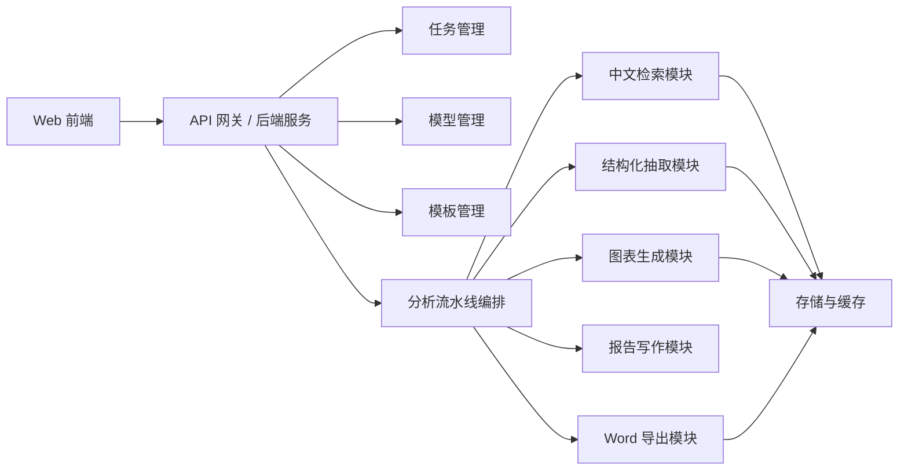
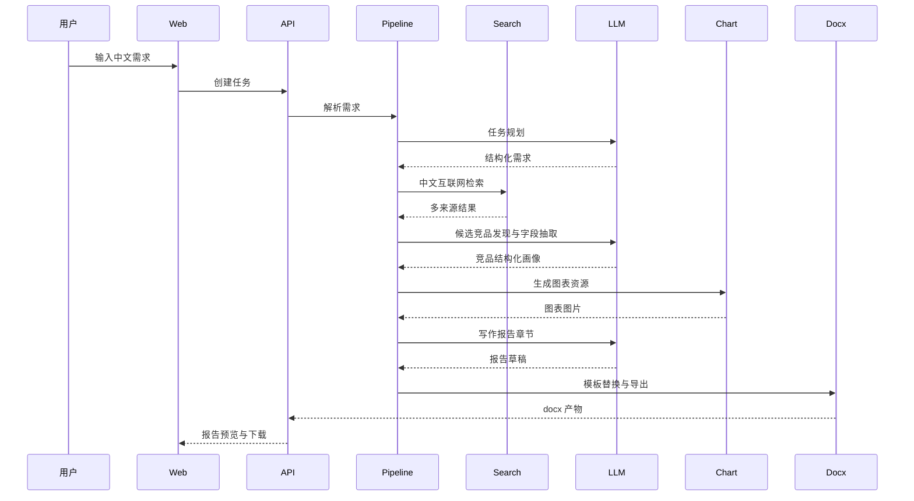

# 自动生成竞品分析报告系统设计

## 1. 产品功能清单

### 1.1 任务创建与自然语言理解

- 输入一句中文需求，自动解析行业、赛道、竞品类型、地域、时间范围、输出目的和重点维度。
- 支持结构化结果回显给用户确认。
- 支持用户指定竞品名单和系统自动发现候选竞品两种模式。
- 支持限制最终分析数量，例如 Top 5、Top 10。

### 1.2 模型配置中心

- 支持多个供应商、多个模型配置。
- 支持配置 `API Base URL`、`API Key`、`model`、`timeout`、`temperature`。
- 支持模型健康检查。
- 支持规划模型、抽取模型、写作模型分路由。

### 1.3 中文互联网检索

- 支持官网、行业媒体、新闻、应用商店、用户评价、公开报告等来源。
- 支持按时间范围筛选、可信度排序、去重去噪。
- 每条来源保留标题、URL、抓取时间、摘要，便于报告溯源。

### 1.4 竞品发现与结构化抽取

- 自动发现候选竞品，并支持分层为直接竞品、间接竞品、替代型竞品。
- 抽取统一字段：定位、用户、功能、价格、商业模式、渠道、优势、劣势、风险等。

### 1.5 图表与 Word 报告

- 根据结构化数据生成饼图、柱状图、折线图、四象限图、对比表格。
- 支持图表主题配置和模板中的图表占位符。
- 最终输出可编辑版与最终版 `.docx`。
- 自动记录生成过程，支持只刷新某一章、某个竞品或某张图表。

## 2. 系统模块设计



### 2.1 前端

- `设置页`
  - 管理模型供应商、模型路由、API 连接测试
- `任务创建页`
  - 输入自然语言需求、确认解析结果、确认候选竞品
- `模板管理页`
  - 上传 `.docx` 模板、配置章节结构、维护占位符
- `报告预览页`
  - 查看章节预览、图表、引用、生成记录，支持局部重跑

### 2.2 后端服务

- `ModelService`
  - 模型配置、健康检查、任务路由
- `TemplateService`
  - Word 模板元数据、章节配置、占位符绑定
- `TaskService`
  - 任务生命周期、状态流转、重试
- `PipelineService`
  - 串联检索、抽取、图表、写作、导出
- `ReportService`
  - 保存报告产物、生成记录和追溯信息

### 2.3 Provider 层

- `LlmProvider`
  - 统一封装 OpenAI 兼容接口和其他模型供应商
- `SearchProvider`
  - 统一封装 SearxNG、SerpAPI、Bing、自研爬虫或 Skill 输出

### 2.4 核心引擎

- `RetrievalPipeline`
  - 查询构造、来源聚合、去重、排序、内容清洗
- `CompetitiveAnalysisPipeline`
  - 任务解析、竞品发现、结构化抽取、图表构造、报告写作
- `WordTemplateEngine`
  - 占位符校验、上下文映射、图表插入、导出

## 3. 数据结构设计

核心数据结构已放在：

- [packages/shared/src/types.ts](/Users/sagima/competitive-report-studio/packages/shared/src/types.ts)

重点对象包括：

- `ModelConnectionConfig`
  - 模型连接配置
- `ModelRoutingConfig`
  - 规划 / 抽取 / 写作模型路由
- `RequirementParseResult`
  - 自然语言需求结构化结果
- `SearchDocument`
  - 检索结果标准结构
- `CompetitorCandidate`
  - 候选竞品
- `CompetitorProfile`
  - 单个竞品结构化画像
- `ChartSpec`
  - 图表数据和插入位定义
- `ReportDraft`
  - 写作阶段报告草稿
- `ReportArtifact`
  - 导出的最终报告产物
- `PipelineSnapshot`
  - 全流程追溯快照

## 4. 页面设计建议

页面骨架已放在：

- [apps/web/src/app/page.tsx](/Users/sagima/competitive-report-studio/apps/web/src/app/page.tsx)
- [apps/web/src/app/tasks/new/page.tsx](/Users/sagima/competitive-report-studio/apps/web/src/app/tasks/new/page.tsx)
- [apps/web/src/app/templates/page.tsx](/Users/sagima/competitive-report-studio/apps/web/src/app/templates/page.tsx)
- [apps/web/src/app/settings/page.tsx](/Users/sagima/competitive-report-studio/apps/web/src/app/settings/page.tsx)
- [apps/web/src/app/reports/[id]/page.tsx](/Users/sagima/competitive-report-studio/apps/web/src/app/reports/[id]/page.tsx)

建议交互如下：

- 任务创建页采用左右双栏。
  - 左侧输入自然语言和任务参数。
  - 右侧展示解析结果和候选竞品。
- 模板管理页突出章节排序和占位符绑定。
- 报告预览页分为章节预览、图表预览、来源预览和生成记录四块。
- 设置页区分“模型连接管理”和“模型路由策略”。

## 5. 核心流程设计



### 关键状态流转

- `draft`
- `awaiting_confirmation`
- `queued`
- `running`
- `failed`
- `completed`

建议在每个阶段持久化中间产物，支持断点续跑：

- 需求解析结果
- 候选竞品列表
- 检索来源集合
- 结构化竞品画像
- 图表规格与图像文件
- 报告草稿
- 最终 Word 产物

## 6. 关键类与接口定义

关键实现代码位于：

- [packages/providers/src/llm/openai-compatible-provider.ts](/Users/sagima/competitive-report-studio/packages/providers/src/llm/openai-compatible-provider.ts)
- [packages/retrieval/src/content-pipeline.ts](/Users/sagima/competitive-report-studio/packages/retrieval/src/content-pipeline.ts)
- [packages/orchestrator/src/analysis-pipeline.ts](/Users/sagima/competitive-report-studio/packages/orchestrator/src/analysis-pipeline.ts)
- [packages/charting/src/chart-renderer.ts](/Users/sagima/competitive-report-studio/packages/charting/src/chart-renderer.ts)
- [packages/docx-engine/src/template-engine.ts](/Users/sagima/competitive-report-studio/packages/docx-engine/src/template-engine.ts)

### 核心接口

- `LlmProvider`
  - `healthCheck(config)`
  - `generateText(config, input)`
- `SearchProvider`
  - `search(query)`
- `ChartRenderer`
  - `render(spec, outputDir)`
- `CompetitiveAnalysisPipeline`
  - `parseRequirement`
  - `buildQueries`
  - `collectSources`
  - `discoverCompetitors`
  - `extractCompetitors`
  - `buildCharts`
  - `writeReport`

## 7. 项目目录结构

```text
competitive-report-studio/
├── apps/
│   ├── api/
│   │   └── src/modules/
│   │       ├── models/
│   │       ├── tasks/
│   │       ├── templates/
│   │       ├── reports/
│   │       └── pipeline/
│   └── web/
│       └── src/app/
├── packages/
│   ├── shared/
│   ├── config/
│   ├── providers/
│   ├── retrieval/
│   ├── charting/
│   ├── docx-engine/
│   └── orchestrator/
└── docs/
```

## 8. 推荐技术栈

### 前端

- `Next.js`
  - 页面与管理后台
- `React 19`
  - 组件与状态管理
- `TanStack Query`
  - 后续接接口缓存和重试
- `React Hook Form + Zod`
  - 后续表单校验

### 后端

- `Node.js + TypeScript`
- `Fastify`
  - 轻量 API 服务
- `BullMQ / Temporal`
  - 生产环境任务队列和长流程编排
- `PostgreSQL`
  - 任务、模板、报告、日志存储
- `Redis`
  - 队列、缓存、去重

### 文档与图表

- `docxtemplater + pizzip`
  - Word 模板替换
- `docx`
  - 纯代码生成补充
- `ECharts SSR` 或 `Chart.js + node-canvas`
  - 图表图片生成

### 检索与抓取

- `Playwright`
  - 动态网页抓取
- `Readability / Turndown`
  - 正文提取与 HTML 转 Markdown
- `SearxNG / SerpAPI / Bing Web Search`
  - 聚合搜索

## 9. 关键实现示例代码

### 9.1 自定义大模型 API 接入

见：

- [packages/providers/src/llm/openai-compatible-provider.ts](/Users/sagima/competitive-report-studio/packages/providers/src/llm/openai-compatible-provider.ts)

设计要点：

- 采用 OpenAI 兼容协议，方便接入国内外兼容接口。
- 统一传入 `baseUrl`、`apiKey`、`model`、`timeoutMs`、`temperature`。
- 通过 `healthCheck` 做连接检测。

### 9.2 检索去重与可信度排序

见：

- [packages/retrieval/src/content-pipeline.ts](/Users/sagima/competitive-report-studio/packages/retrieval/src/content-pipeline.ts)

设计要点：

- 多 provider 并发查询。
- 以标准化 URL 做去重主键。
- 按来源可信度排序。

### 9.3 流水线编排

见：

- [packages/orchestrator/src/analysis-pipeline.ts](/Users/sagima/competitive-report-studio/packages/orchestrator/src/analysis-pipeline.ts)

设计要点：

- 不把规划、抽取、写作绑死到一个模型上。
- 用 `providerResolver(modelId)` 支持任务级路由。
- 所有中间结果可以被保存成 `PipelineSnapshot`。

## 10. Word 模板占位符方案

### 推荐规则

- 报告级
  - `{{report.title}}`
  - `{{report.executive_summary}}`
- 章节级
  - `{{section.industry_background}}`
  - `{{section.competitor_list}}`
  - `{{section.feature_comparison}}`
  - `{{section.business_model}}`
  - `{{section.opportunities}}`
- 图表级
  - `{{charts.feature_matrix}}`
  - `{{charts.position_quadrant}}`
- 附录级
  - `{{appendix.sources}}`

### 推荐映射策略

- 文本段落使用 `markdown -> docx` 渲染
- 表格用二维数组或对象数组渲染
- 图表占位符映射到生成图片路径
- 附录来源按编号自动生成

模板管理元数据见：

- [apps/api/src/modules/templates/template-service.ts](/Users/sagima/competitive-report-studio/apps/api/src/modules/templates/template-service.ts)

## 11. 图表生成与插图插入方案

当前代码示例见：

- [packages/charting/src/chart-renderer.ts](/Users/sagima/competitive-report-studio/packages/charting/src/chart-renderer.ts)

推荐生产策略：

- `ChartSpec` 作为统一图表 DSL
- 图表生成前追加“图表专用检索”
- 图表专用检索沿用当前任务选择的检索模式，例如 `Mock`、`SerpAPI(Baidu)`、`Search API`、`Skill Bridge`、`Hybrid`
- 渲染阶段输出 `png` 或 `svg`
- 报告阶段按 `placeholderKey` 自动插入图表
- 每张图记录 `sourceRefs` 和 `inferenceNotes`

### 图表示例

- 柱状图
  - 功能覆盖度对比
- 四象限图
  - 产品成熟度 x 行业聚焦度
- 对比表
  - 价格策略 / 功能 / 渠道 / 优劣势

## 12. 如何接入自定义大模型 API

### 接入方式

1. 在设置页填写：
   - `API Base URL`
   - `API Key`
   - `模型名称`
   - `timeout`
   - `temperature`
2. 保存为 `ModelConnectionConfig`
3. 通过 `ModelRoutingConfig` 绑定到规划、抽取、写作任务
4. 执行健康检查
5. 流水线运行时根据 `modelId` 解析对应 provider

### 适配原则

- 优先采用 OpenAI 兼容协议
- 非兼容模型单独实现 provider，不影响主链路
- 所有 provider 对上层暴露同一组接口

## 13. 如何实现中文互联网检索

### 建议的生产实现分层

- `搜索聚合层`
  - 调用 SearxNG、SerpAPI、Bing Web Search
- `抓取层`
  - 对搜索命中的 URL 进行正文提取
- `清洗层`
  - 去广告、去导航、去重复段落
- `归一化层`
  - 标准化到 `SearchDocument`
- `可信度层`
  - 根据域名、文章来源、发布时间、内容完整度打分

### 中文场景建议优先级

- 企业官网
- 行业媒体
- 新闻源
- 应用商店与 SaaS 市场页
- 用户评价社区
- 券商或咨询公开报告

### 适合做成 Skill 的能力

- 浏览器辅助抓取
- 单站点内容采集
- 特定媒体站点解析规则

### 更适合做成常规服务的能力

- 检索聚合
- 去重排序
- 数据标准化
- 任务编排
- 报告导出

原因是这些部分需要稳定、可监控、可重试和批量处理，不适合完全依赖交互式 Skill。

## 14. 完整流水线串联方式

### 生产推荐流水线

1. `Requirement Parsing`
   - 自然语言转结构化任务
2. `Query Planning`
   - 根据赛道、重点维度和时间范围生成检索 query
3. `Search + Crawl`
   - 拉取中文互联网多来源内容
4. `Candidate Discovery`
   - 自动发现候选竞品，等待用户确认
5. `Structured Extraction`
   - 对每个竞品抽取统一字段
6. `Insight Synthesis`
   - 形成差异化结论、机会点和建议
7. `Chart Rendering`
   - 先做图表专用检索，再输出图表资源
8. `Report Writing`
   - 生成章节正文、摘要、附录
9. `Word Export`
   - 套模板、插图表、导出 docx
10. `Snapshot Persistence`
   - 保存所有中间产物，支持断点续跑和局部刷新

### 任务队列建议

- 拆成独立 job：
  - `parse_requirement`
  - `search_sources`
  - `discover_candidates`
  - `extract_profiles`
  - `render_charts`
  - `write_report`
  - `export_docx`
- 每个 job 保存自己的输入、输出和日志。
- 失败后只重试当前步骤，不重做全部流程。

## 补充建议

### 更接近真实产品时应优先继续补的内容

- 把 `TaskService`、`TemplateService`、`ReportService` 从内存存储换成 PostgreSQL
- 把 `MockChineseSearchProvider` 替换为真实搜索 + 抓取 + 清洗链路
- 把 `WordTemplateEngine` 换成真正的 `.docx` 模板替换实现
- 引入 BullMQ 或 Temporal 支撑长任务
- 为章节重写、竞品局部刷新、图表局部刷新设计增量更新策略

### 当前骨架的定位

- 不是纯文档方案，而是一个可继续扩展的工程起点
- 已把目录、核心对象、前后端页面、Provider 抽象和主流水线串起来
- 适合继续往“真实可用产品”方向推进
